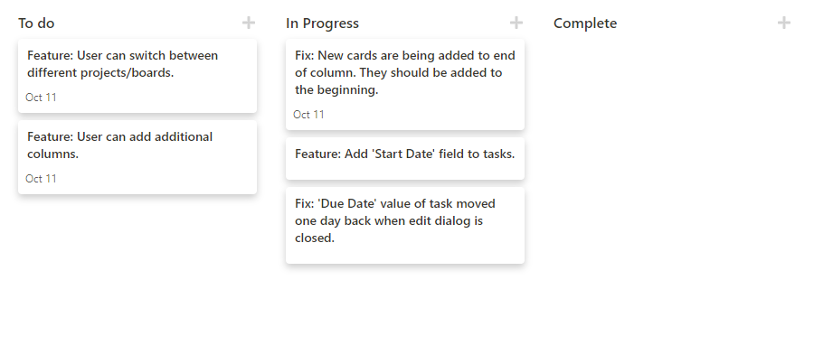

## Devee

Devee is a simple Kanban Board/Task Tracker that allows you to create tasks that you can move between columns to track categories such as status. The UI is heavily inspired by the application Notion.so

## Motivation

This project was built to allow myself to track my tasks in a way that is tailored to my needs.

## Built with

* [React](https://reactjs.org/) - Main front end library
* [Flask](https://flask.palletsprojects.com/en/1.1.x/) - Backend API

## Screenshots

## Installation
 
 - TODO: Complete Installation steps

## How to use?

- TODO: Complete How to use steps